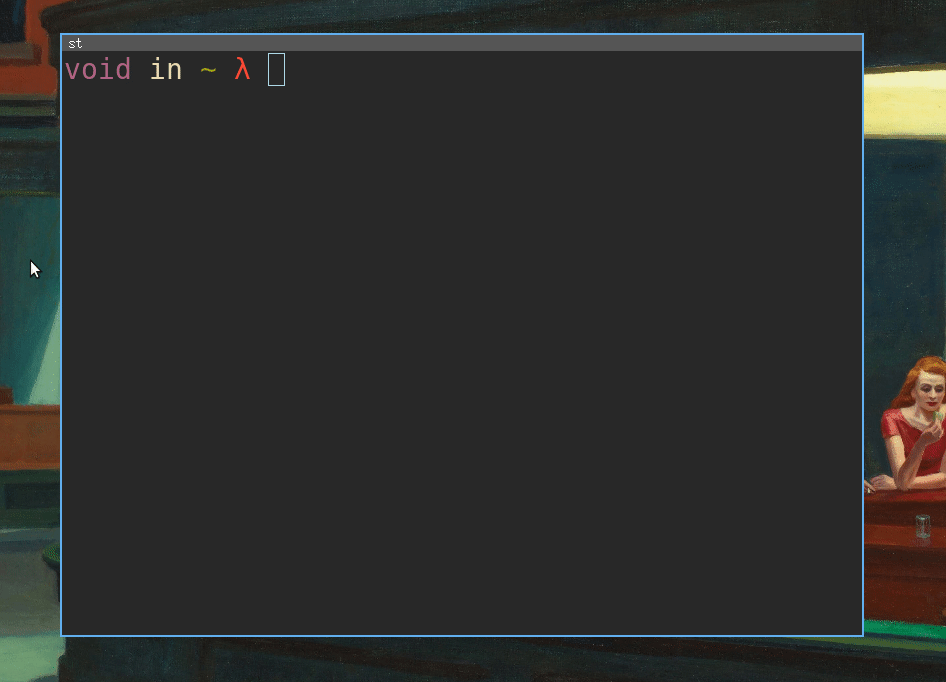

[](https://github.com/Kaderovski)
[](https://choosealicense.com/licenses/mit/)
<p align="center">
    
</p>
<p align="center"><i>b is (an ugly) a tool that allows you to copy your Bitwarden/Vaultwarden password directly from your terminal.</i></p>


### Demo


### Dependencies
- `bw` (Bitwarden cli)
- `xclip`
- `jq`
- `fzf`
- `fzf-tmux`

### Installation
You need to create a Bitwarden token, [check documentation here](https://bitwarden.com/help/personal-api-key/).
Then set variables in b script.

```shell
# Fill these vars
export BW_CLIENTID=''
export BW_CLIENTSECRET=''
export BW_PASSWORD=''
```

Finally move `b` file to `/usr/local/bin`.
```shell
sudo mv b /usr/local/bin 
```

### Usage
Search for a password :
```shell
# ex, search github password
b github
```

Sync vault (download new password from Bitwarden/Vaultwarden server):
```shell
b --sync
```


